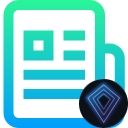

<a name="readme-top"></a>

[![MIT License][license-shield]][license-url]


<!-- PROJECT LOGO -->
<br />
<div align="center">
  <a href="https://github.com/NebulaLabsOrg/nebula-js-libraries">
    
  </a>

  <h3 align="center">Browser Injected Web3 Connection</h3>

  <p align="center">
    <br />
    <a href="https://www.coingecko.com/api/documentation"><strong>Explore API docs »</strong></a>
    <br />
    <br />
</div>


<!-- TABLE OF CONTENTS -->
<details>
  <summary>Table of Contents</summary>
  <ol>
    <li>
      <a href="#about-the-project">About The Project</a>
      <ul>
        <li><a href="#built-with">Built With</a></li>
      </ul>
    </li>
    <li>
      <a href="#getting-started">Getting Started</a>
      <ul>
        <li><a href="#prerequisites">Prerequisites</a></li>
        <li><a href="#installation">Installation</a></li>
      </ul>
    </li>
    <li><a href="#functions">Functions</a></li>
    <li><a href="#license">License</a></li>
    <li><a href="#contact">Contact</a></li>
  </ol>
</details>


<!-- ABOUT THE PROJECT -->
## About The Project

Simple and easy to use connection to WEB3 for browser injected wallets providers.

<p align="right">(<a href="#readme-top">back to top</a>)</p>


### Built With

Here the list of any major frameworks/libraries used to build the library.

* [![Javascript][Javascript]][Javascript-url]
* [![Ethers.js][Ethersjs]][Ethersjs-url]

<p align="right">(<a href="#readme-top">back to top</a>)</p>


<!-- GETTING STARTED -->
## Getting Started

### Prerequisites

In the main project install axios
* npm
  ```sh
  npm install --save ethers
  ```

### Installation

_Once imported follow these simple steps to use the library_

1. Copy the `coingecko-api-interface` in your repos
2. Import where needed the costruct
   ```js
   import web3Connection from '*YOUR DIRECTORY*/web3-connection/index.js';
   ```

<p align="right">(<a href="#readme-top">back to top</a>)</p>


<!-- FUNCTIONS -->
## Functions
_Following all the function integrated_

### Connect to Web3
_Connect to desired blockchain. Mange wallet compatibility and Force new blockchains._
1. Function call
   ```js
   let connection = await web3Connection.browser.connect(
    chainID  //chain ID as number
   );
   ```
2. Responce
   ```js
   connection.code //function status. Error if !=200
   connection.msg  //function message status
   connection.data //Connection info and interfaces
      data.userAddress  //User connected address
      data.userProvider //User provider interface
      data.userSinger   //User signer interface
      data.userChainId  //Chain user is connected
   ```

### Get connected chain data
_Get conneceted chain identification data_
1. Function call
   ```js
   let chainData = await await web3Connection.browser.get.currentNetworkData(
      Provider  //PRovider intreface
   );
   ```
2. Responce
   ```js
   chainData.chainId     //chain id
   chainData.ensAddress  //ENS address
   chainData.name        //rpc provider name
   ```

### Get chain data
_Get chain data from any chain ID_
1. Function call
   ```js
   let chainData = await await web3Connection.browser.get.specificNetworkData(
      ChainId  //chain ID as number
   );
   ```
2. Responce
   ```js
   chainData.chainId     //chain id
   chainData.ensAddress  //ENS address
   chainData.name        //rpc provider name
   ```

<p align="right">(<a href="#readme-top">back to top</a>)</p>


<!-- LICENSE -->
## License

Distributed under the MIT License. See `LICENSE.txt` for more information.

<p align="right">(<a href="#readme-top">back to top</a>)</p>


<!-- CONTACT -->
## Contact

Nebula Labs 🌌 - [@NebulaLabsOrg](https://twitter.com/NebulaLabsOrg)

Gloom0x0 - [@gloom0x0](https://twitter.com/gloom0x0)

Hyper0x0 - [@hyper0x0](https://twitter.com/hyper0x0)

<p align="right">(<a href="#readme-top">back to top</a>)</p>


<!-- MARKDOWN LINKS & IMAGES -->
<!-- https://www.markdownguide.org/basic-syntax/#reference-style-links -->
[license-shield]: https://img.shields.io/github/license/othneildrew/Best-README-Template.svg?style=for-the-badge
[license-url]: https://github.com/NEONdAPP/neon-libraries/data/coingecko-api-interface/LICENSE.txt
[Javascript]: https://img.shields.io/badge/javascript-000000?style=for-the-badge&logo=javascript&logoColor=yellow
[Javascript-url]: https://developer.mozilla.org/en-US/docs/Web/JavaScript?retiredLocale=it
[Ethersjs]: https://img.shields.io/badge/Ethers.js-000000?style=for-the-badge&logo=solidity
[Ethersjs-url]: https://docs.ethers.org/v5/
